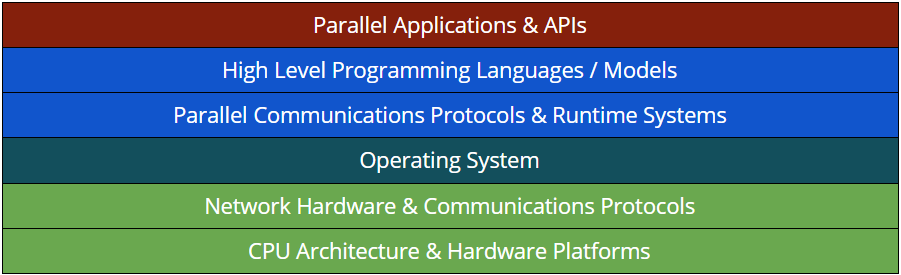

# Systemy równoległe i rozproszone - 26.02.2019
---

### Klastry
_Źródła:  “Cluster Computing - Architecture, Operating Systems, Parallel Processing & Programming Languages”_

__General rule of thumb__

_Kod równoległy musi być szybszy od szeregowego._

### Klasyfikacje (SCHEMATY)
###### SISD 
Single Instruction stream / Single Data stream

###### SIMD 
Single Instruction stream / Multiple Data Stream - operacje na kartach graficznych

###### MISD 
Multiple Instruction stream / Single Data stream (czysto teoretycznie)

###### MIMD 
Multiple Instruction stream / Multiple Data stream - niezależny strumień instrukcji, niezależny strumień danych (mogą być te same instrukcje i te same dane)

	Każdy procesor wykonuje indywidualną sekwencje instrukcji,
	Każdy procesor pracuje nad inną częścią zagadnienia,
	Każdy procesor może komunikować się z innymi,
	Procesory mogą czekać na inne procesory bądź na dostęp do danych.

---

Ponieważ schemat MIMD zawiera w sobie wiele klas komputerów w 1988 E. Johnson zaproponował dalszy podział:
###### GMSV 
Global Memory / Shared Variables,

###### GMMP 
Global Memory / Message Passing,

###### DMSV 
Distributed Memory / Shared Variables,

###### DMMP 
Distributed Memory / Message Passing.

---

Przedstawione modele mogą również być mieszane.
Klasyfikacje dalsze:
* Multiprocessors _(Shared Memory)_
* Multicomputers _(Private Memory)_

| Zalety                                                      	| Wady                                                                                   	|
|-------------------------------------------------------------	|----------------------------------------------------------------------------------------	|
| Wysoka moc obliczeniowa i przepustowość                     	| Ograniczona ilość oprogramowania (szczególnie komercyjnego)                            	|
| Niezawodność                                                	| Wydajność sieci ma kolosalny wpływ na wydajność systemu  (w niektórych zastosowaniach) 	|
| Odporność na awarie                                         	| Problemy z bezpieczeństwem (zwiększenie bezpieczeństwa powoduje spadek wydajności)     	|
| Wysoki stosunek jakość/cena                                 	|                                                                                        	|
| Możliwość łatwej rozbudowy                                  	|                                                                                        	|
| Możliwość łatwego przekraczania ograniczeń technologicznych 	|                                                                                        	|
| Łatwość zastosowania w wielu problemach obliczeniowych      	|                                                                                        	|

---

###### Jak zbudować tani superkomputer?
Wydajność?

Sprzęt?

Systemy operacyjne?

Middleware? ► coś pomiędzy systemem, a aplikacją

Aplikacje?

---

### Warstowy model klastra:

---

### Wydajność
Szacuje się że superkomputery przeciętnie wykorzystują tylko 10% szczytowej mocy obliczeniowej.
Główne przyczyny utraty mocy obliczeniowej:
* Problem, których chcemy rozwiązać,
* Algorytm, którego używamy,
* Wykorzystywany język oraz kompilator,
* System operacyjny,
* Hardware.

###### Etapy pracy nad przyrostem wydajności:
* Porównanie nowych rozwiązań z istniejącymi,
* Dopasowanie algorytmów do architektur i odwrotnie,
* Poprawa zastosowanych rozwiązań.

---

### Metryki wydajności:
###### MIPS 
million instruction per second

###### FLOPS 
floating operations per second

---

### CZAS WYKONANIA [s]
###### Przyspiesznie:
	Sp = T1/Tp

Przyjmuje się wartości od 1 do p. (p- ilość komputerów)

###### Efektywność:
	Ep = Sp/P = T1/p*Tp

###### Redundancja:
	Rp = Op/O1 - wzrost ilości operacji

###### Wykorzystanie:
	Up = Op/p*Tp

###### Jakość:
	Qp = T1^3/p*Tp^2*Op

---

### Granice wydajności:
	Granica optymistyczna - N
		.
		.
		.
	Sweet Spot
		.
		.
		.
	Granica pesymistyczna - Log2N

### Prawo Amdahla